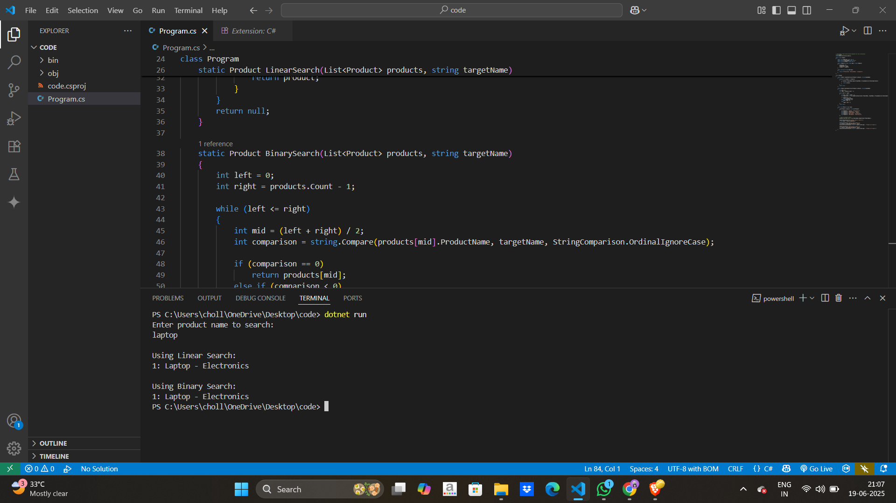

# 🛒 E-commerce Platform Search (C#)

This C# console app demonstrates two common search algorithms — **Linear Search** and **Binary Search** — for searching through a list of products in an e-commerce platform.

---

## 📦 Features

- **Product Class**  
  Represents each product with:
  - `ProductId`
  - `ProductName`
  - `Category`

- **Linear Search**  
  Iterates through the product list to find a match.

- **Binary Search**  
  A fast, efficient search on a **sorted** product list.

---

## 🚀 How to Run

### Prerequisites

- [.NET SDK 8.0+](https://dotnet.microsoft.com/en-us/download/dotnet/8.0)
- Visual Studio Code or any C#-friendly IDE

### Steps

1.Open terminal in that folder

```bash
cd E-commerce
```

2.For run the program 

```bash 
dotnet run
```
   
   
### Output 

