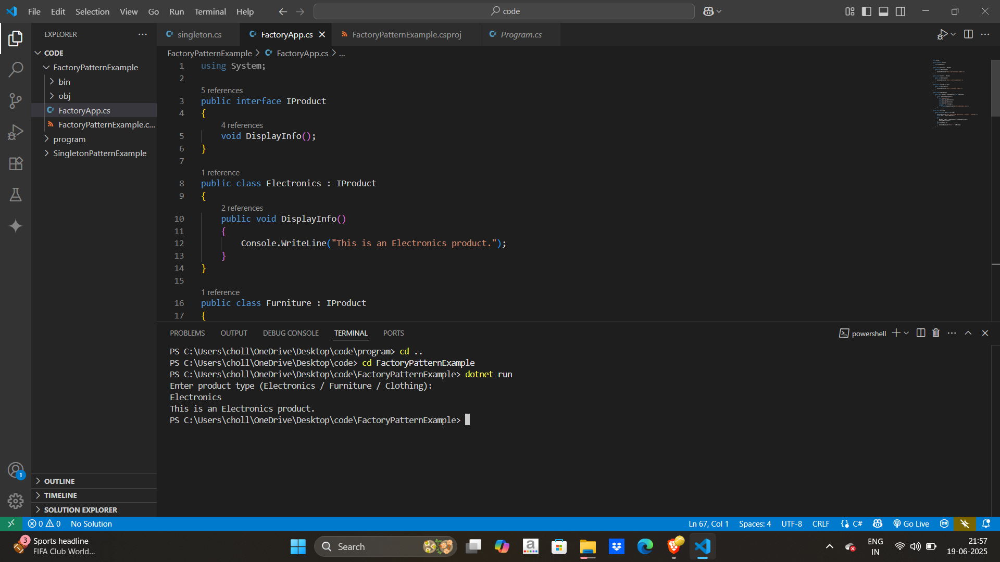

# 🏭 Factory Pattern Example in C#

This project demonstrates the implementation of the **Factory Design Pattern** in C#. The Factory Pattern is used to create objects without specifying the exact class of the object that will be created.

In this example, we have a **ProductFactory** that creates different types of products, such as **Electronics**, **Furniture**, and **Clothing**.

---

## 📌 What is the Factory Pattern?

The Factory Pattern:
- Provides an interface for creating objects, but allows subclasses to alter the type of objects that will be created.
- Abstracts the instantiation logic, which is useful for creating objects in a flexible and reusable way.

---

## 🚀 How to Run

### Prerequisites

- [.NET SDK 8.0+](https://dotnet.microsoft.com/en-us/download/dotnet/8.0)
- Visual Studio Code or any C#-friendly IDE

### Steps

1.Open terminal in that folder
```bash
cd FactoryPatternExample
```

2.For run the program 
```bash 
dotnet run
```


### Output 

