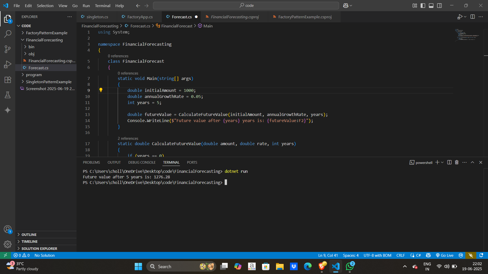

# 📈 Financial Forecasting - Future Value Calculation

This C# program demonstrates how to calculate the **future value** of an investment based on an **initial amount**, **annual growth rate**, and the number of **years** using **recursion**.

In the example, we calculate the future value of an investment of **$1000** with a **5% annual growth rate** over **5 years**.

---

## 📦 Features

- **Recursive Calculation**: Calculates future value using a recursive approach.
- **Customizable**: You can change the initial amount, growth rate, and years to see different forecasts.
- **Simple Console Output**: Displays the future value after the given number of years.

---

## 🚀 How to Run

### Prerequisites

- [.NET SDK 8.0+](https://dotnet.microsoft.com/en-us/download/dotnet/8.0)
- Visual Studio Code or any C#-friendly IDE

### Steps

1.Open terminal in that folder
```bash
cd FinancialForecasting
```
2.For run the program 
```bash 
dotnet run
```
   
### Output 

