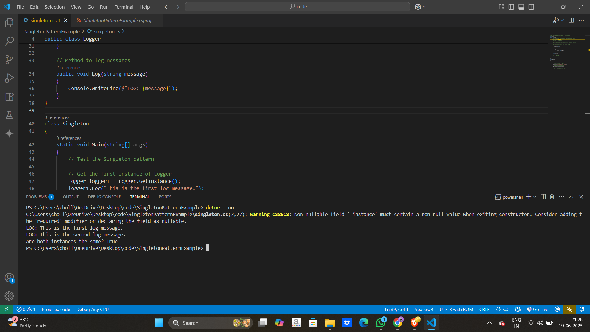

# 🧩 Singleton Pattern Example in C#

This project demonstrates how to implement the **Singleton Design Pattern** in C#. The pattern ensures that a class has **only one instance** throughout the application's lifecycle.

In this example, the Singleton is used to manage a global `Logger` instance.

---

## 📌 What is the Singleton Pattern?

The Singleton Pattern:
- Restricts a class to a **single instance**
- Provides a **global point of access** to that instance
- Is commonly used for:
  - Logging
  - Configuration management
  - Database connections

---

## 🚀 How to Run

### Prerequisites

- [.NET SDK 8.0+](https://dotnet.microsoft.com/en-us/download/dotnet/8.0)
- Visual Studio Code or any C#-friendly IDE

### Steps

1.Open terminal in that folder

```bash
cd SingletonPatternExample
```


2.For run the program 

```bash 
dotnet run
```

   
### Output 

