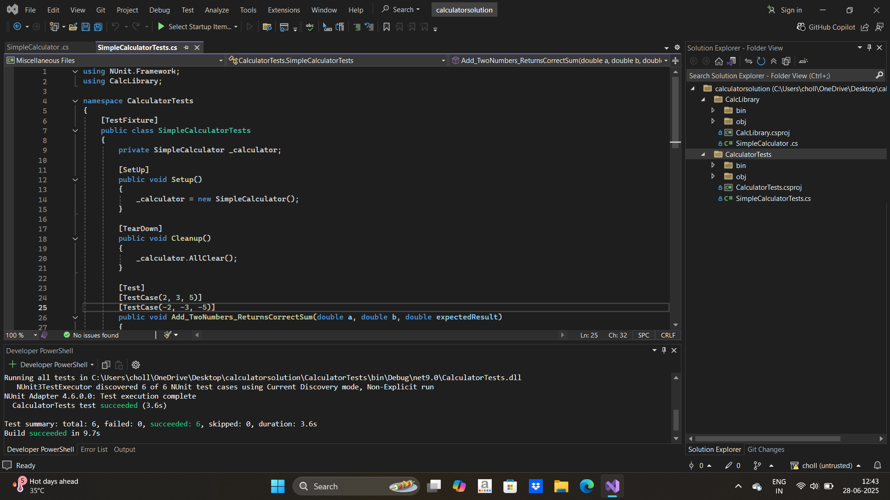

# Unit Testing with NUnit - Calculator Example

This project demonstrates how to use **NUnit** for Unit Testing, and the various aspects involved in testing:

- **SetUp**: Initialize the resources needed for testing.
- **TearDown**: Clean up after each test to ensure that no state is carried over between tests.
- **TestCase**: Use parameterized tests to run the same test with multiple input values.
- **Assert**: Validate the results using assertions to verify that the expected output matches the actual output.

The project includes a simple calculator library `CalcLibrary` with methods for basic operations. We will write unit tests to check if the operations work as expected.

---

## Prerequisites

Ensure that you have the following installed:

1. **Visual Studio 2022** (or later version).
2. **.NET 9.0 SDK** or any other compatible .NET SDK.
3. **NUnit** Framework for unit testing.
4. **NUnit3TestAdapter** for running NUnit tests inside Visual Studio.
5. **coverlet.collector** for code coverage.
6. Basic knowledge of **Unit Testing** and **NUnit** framework.

---

## Setting Up the Project

### 1. Clone the Repository

Clone the repository to your local machine:

```bash
git clone <repository-url>
cd <repository-directory>
````

### 2. Open the Solution in Visual Studio

* After cloning the repository, open the solution file `CalculatorApp.sln` in **Visual Studio 2022**.

### 3. Install Dependencies

You can install the necessary NuGet packages using **NuGet Package Manager** or via the **Package Manager Console**.

#### Install NuGet Packages:

* Open **Tools > NuGet Package Manager > Manage NuGet Packages for Solution**.
* Search for and install the following packages for the **CalculatorTests** project:

  * **NUnit** (`4.2.2`)
  * **NUnit3TestAdapter** (`4.6.0`)
  * **coverlet.collector** (`6.0.2`)
  * **Microsoft.NET.Test.Sdk** (`17.12.0`)
---

## Writing Unit Tests

In this step, you will write the unit tests for the `SimpleCalculator` class.

**Create a New Unit Test Project**

* In Visual Studio, right-click the solution and choose **Add > New Project**.
* Choose **Class Library (.NET Core)** and name it `CalculatorTests`.
* After creating the project, right-click it in the Solution Explorer and choose **Add > Reference**.
* Add a reference to the `CalcLibrary` project.


## Running the Tests in Visual Studio 2022

### 1. Open **Test Explorer**

To run the tests, first ensure **Test Explorer** is visible in Visual Studio:

* Go to **Test > Windows > Test Explorer**.

### 2. Build the Solution

* Before running the tests, click **Build > Build Solution** (or press `Ctrl + Shift + B`) to compile your solution.

### 3. Run the Tests

* In **Test Explorer**, you should see the `SimpleCalculatorTests` class with all the test methods listed.
* Click **Run All** to execute all the tests.
* Alternatively, you can right-click on individual tests and select **Run** to execute them one by one.

---

## Output


