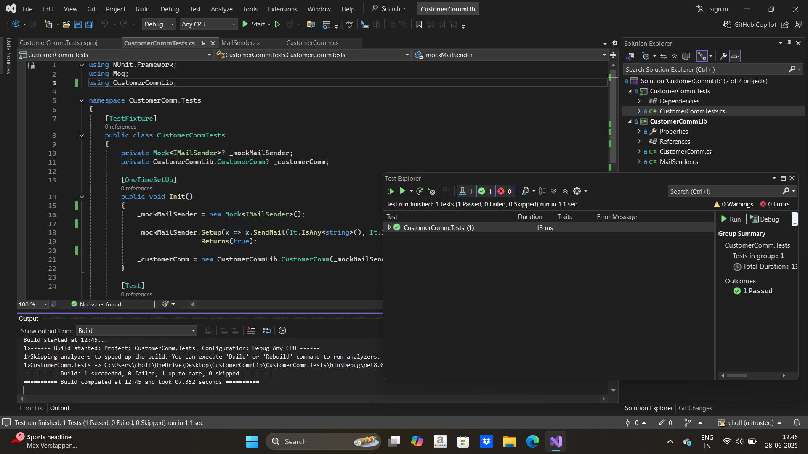

# CustomerCommLib - Unit Testing with Moq and NUnit

This project demonstrates how to use **Unit Testing** to test a module that sends emails through an SMTP server using **Moq** for mocking and **NUnit** for testing. The goal is to simulate the email-sending process without actually sending an email, thus isolating the functionality and enabling fast and reliable unit tests.

---

## Prerequisites

Before you begin, make sure you have the following installed:

1. **Visual Studio** (or any IDE with support for .NET development).
2. **.NET Framework 4.8 or .NET 8.0** (depending on the version you choose for the project).
3. **NUnit Framework** for writing unit tests.
4. **Moq Library** for mocking dependencies.
5. Basic knowledge of **Unit Testing**, **Mocking**, and **Dependency Injection (DI)**.

---

## Setup Instructions

### 1. Clone the Repository

```bash
git clone <repository-url>
cd <repository-directory>
````

### 2. Open the Project in Visual Studio

* Open **Visual Studio** and load the **CustomerCommLib** and **CustomerComm.Tests** projects from the solution file.

### 3. Install Dependencies

* **CustomerCommLib** project:

  * No external dependencies are needed for this project (unless you modify it to use other libraries).
* **CustomerComm.Tests** project:

  * Right-click on the **CustomerComm.Tests** project and select **Manage NuGet Packages**.
  * Install the following packages:

    * **Moq**: Version `4.20.72`
    * **NUnit**: Version `4.3.2`
    * **NUnit3TestAdapter**: Version `5.0.0`

Alternatively, you can add them via the `.csproj` file.

---

## How to Run the Project

### 1. **Build the Projects**

After setting up the dependencies, build both projects by pressing `Ctrl + Shift + B` or selecting **Build Solution** from the **Build** menu.

### 2. **Run Unit Tests**

* Open **Test Explorer** in Visual Studio.
* Click **Run All** to run all tests in the **CustomerComm.Tests** project.
* The tests will run, and you should see a green check mark if everything is successful.

---

## Output

### Output 

