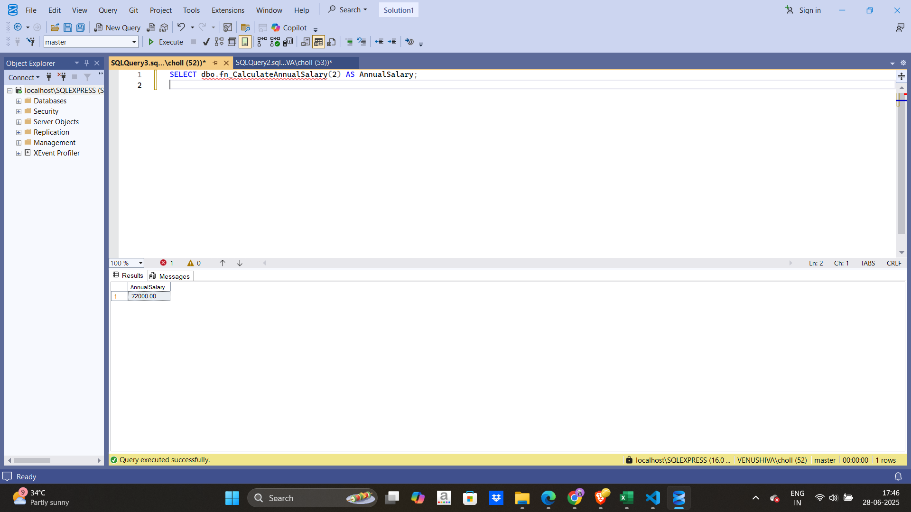

# Employee Management System - SQL Exercises

The Employee Management System is designed to manage employee details, including personal information, salary, and department allocation. This system is built on a SQL database with two main tables: **Departments** and **Employees**. It allows for managing department information and employee details and includes exercises like calculating annual salaries using SQL functions.

## Database Schema

### 1. Departments Table

This table stores information about various departments in the organization.

| Column         | Data Type         | Description            |
| -------------- | ----------------- | ---------------------- |
| DepartmentID   | INT (Primary Key) | Unique department ID   |
| DepartmentName | VARCHAR(100)      | Name of the department |

### 2. Employees Table

This table stores details about employees, including their department affiliation and salary.

| Column       | Data Type         | Description                     |
| ------------ | ----------------- | ------------------------------- |
| EmployeeID   | INT (Primary Key) | Unique employee ID              |
| FirstName    | VARCHAR(50)       | Employee's first name           |
| LastName     | VARCHAR(50)       | Employee's last name            |
| DepartmentID | INT (Foreign Key) | Linked to the Departments table |
| Salary       | DECIMAL(10, 2)    | Monthly salary                  |
| JoinDate     | DATE              | Date of joining                 |

## Sample Data

### Departments

| DepartmentID | DepartmentName |
| ------------ | -------------- |
| 1            | HR             |
| 2            | IT             |
| 3            | Finance        |

### Employees

| EmployeeID | FirstName | LastName | DepartmentID | Salary  | JoinDate   |
| ---------- | --------- | -------- | ------------ | ------- | ---------- |
| 1          | John      | Doe      | 1            | 5000.00 | 2020-01-15 |
| 2          | Jane      | Smith    | 2            | 6000.00 | 2019-03-22 |
| 3          | Bob       | Johnson  | 3            | 5500.00 | 2021-07-01 |

## SQL Exercises

### Exercise 7: Return Data from a Scalar Function

**Goal**: Return the annual salary for a specific employee using the `fn_CalculateAnnualSalary` function.

#### Steps:

1. Execute the `fn_CalculateAnnualSalary` function for an employee with `EmployeeID = 1`.
2. Verify the result.

#### SQL Code

1. **Create Employees Table**

```sql
CREATE TABLE Employees (
    EmployeeID INT PRIMARY KEY,
    FirstName VARCHAR(50),
    LastName VARCHAR(50),
    DepartmentID INT,
    Salary DECIMAL(10,2), 
    JoinDate DATE
);
```

2. **Insert Sample Data into Employees Table**

```sql
INSERT INTO Employees (EmployeeID, FirstName, LastName, DepartmentID, Salary, JoinDate)
VALUES 
(1, 'John', 'Doe', 1, 5000.00, '2020-01-15'),
(2, 'Jane', 'Smith', 2, 6000.00, '2019-03-22'),
(3, 'Bob', 'Johnson', 3, 5500.00, '2021-07-01');
```

3. **Create the Scalar Function `fn_CalculateAnnualSalary`**

```sql
CREATE FUNCTION fn_CalculateAnnualSalary
(
    @EmpID INT
)
RETURNS DECIMAL(10,2)
AS
BEGIN
    DECLARE @AnnualSalary DECIMAL(10,2)

    SELECT @AnnualSalary = Salary * 12
    FROM Employees
    WHERE EmployeeID = @EmpID

    RETURN @AnnualSalary
END;
```

4. **Execute the Function to Calculate the Annual Salary**

```sql
SELECT dbo.fn_CalculateAnnualSalary(2) AS AnnualSalary;
```
### Output



---

