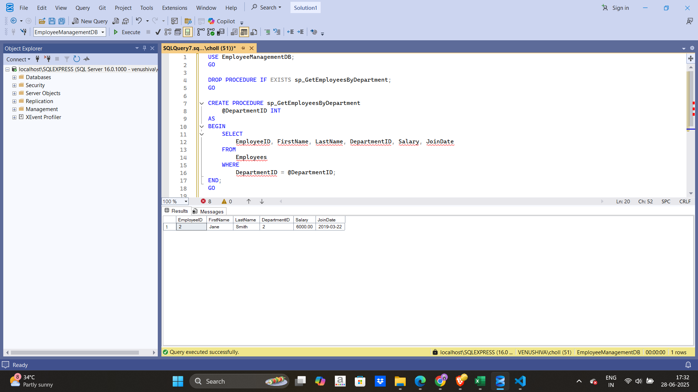
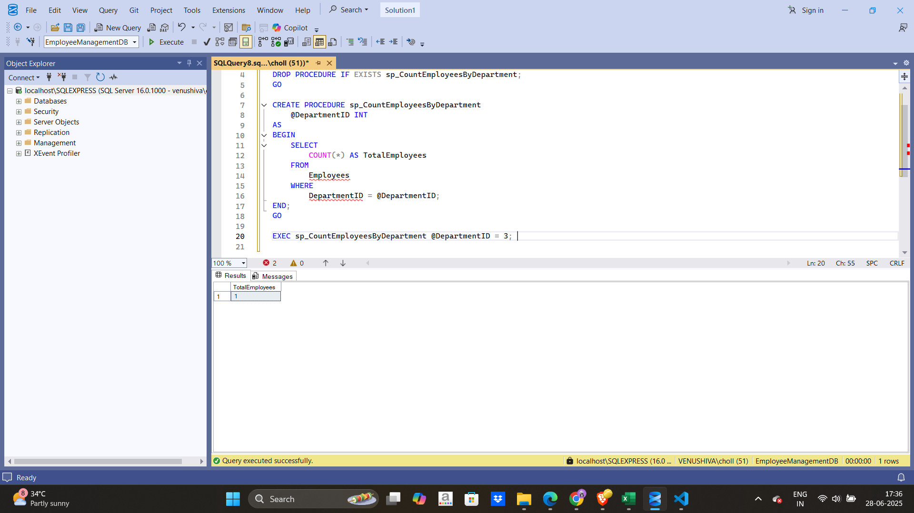

# Employee Management System - SQL Exercises

This Employee Management System (EMS) allows managing employee data such as names, departments, and salaries. The SQL exercises help in creating stored procedures, handling employee data, and retrieving information based on various criteria (e.g., by department).

---

## Prerequisites

Before starting with the exercises, ensure you have the following:

1. **SQL Server Management Studio (SSMS)** installed on your machine.
2. Access to an **SQL Server instance** (local or remote).
3. Basic understanding of SQL syntax, stored procedures, and how to execute SQL commands.

---

## Setting Up the Database

To get started, you need to create the database and tables. Follow these steps:

1. Open **SSMS** and connect to your SQL Server instance.
2. Create a new database by running the following SQL script:

```sql
CREATE DATABASE EmployeeManagementDB;
GO

USE EmployeeManagementDB;
GO
 
CREATE TABLE Departments (
    DepartmentID INT PRIMARY KEY,
    DepartmentName VARCHAR(100)
);

CREATE TABLE Employees (
    EmployeeID INT PRIMARY KEY,
    FirstName VARCHAR(50),
    LastName VARCHAR(50),
    DepartmentID INT FOREIGN KEY REFERENCES Departments(DepartmentID),
    Salary DECIMAL(10,2),
    JoinDate DATE
);

INSERT INTO Departments (DepartmentID, DepartmentName) VALUES
(1, 'HR'),
(2, 'Finance'),
(3, 'IT'),
(4, 'Marketing');

INSERT INTO Employees (EmployeeID, FirstName, LastName, DepartmentID, Salary, JoinDate) VALUES
(1, 'John', 'Doe', 1, 5000.00, '2020-01-15'),
(2, 'Jane', 'Smith', 2, 6000.00, '2019-03-22'),
(3, 'Michael', 'Johnson', 3, 7000.00, '2018-07-30'),
(4, 'Emily', 'Davis', 4, 5500.00, '2021-11-05');

```

---

## Exercise 1: Create a Stored Procedure

**Goal:** Create a stored procedure to retrieve employee details by department.

### Steps:

1. Define the stored procedure `sp_GetEmployeesByDepartment` with a parameter for `DepartmentID`.
2. Write the SQL query to retrieve employee details based on the `DepartmentID`.

Run the following script to create the stored procedure:

```sql
USE EmployeeManagementDB;
GO

CREATE PROCEDURE sp_GetEmployeesByDepartment
    @DepartmentID INT
AS
BEGIN
    SELECT 
        EmployeeID, FirstName, LastName, DepartmentID, Salary, JoinDate
    FROM 
        Employees
    WHERE 
        DepartmentID = @DepartmentID;
END;
GO

EXEC sp_GetEmployeesByDepartment @DepartmentID = 2;

```

---

## Exercise 4: Execute a Stored Procedure

**Goal:** Execute the stored procedure to retrieve employee details for a specific department.

### Steps:

1. Execute the `sp_GetEmployeesByDepartment` stored procedure with a `DepartmentID` of `2` (Finance).

Run the following SQL command to execute the stored procedure:

```sql
USE EmployeeManagementDB;
GO

DROP PROCEDURE IF EXISTS sp_GetEmployeesByDepartment;
GO

CREATE PROCEDURE sp_GetEmployeesByDepartment
    @DepartmentID INT
AS
BEGIN
    SELECT 
        EmployeeID, FirstName, LastName, DepartmentID, Salary, JoinDate
    FROM 
        Employees
    WHERE 
        DepartmentID = @DepartmentID;
END;
GO

EXEC sp_GetEmployeesByDepartment @DepartmentID = 2;

```
### Output


---

## Exercise 5: Return Data from a Stored Procedure

**Goal:** Create a stored procedure that returns the total number of employees in a department.

### Steps:

1. Define the stored procedure `sp_CountEmployeesByDepartment` with a parameter for `DepartmentID`.
2. Write the SQL query to count the number of employees in the specified department.

Run the following script to create the `sp_CountEmployeesByDepartment` stored procedure:

```sql
USE EmployeeManagementDB;
GO

DROP PROCEDURE IF EXISTS sp_CountEmployeesByDepartment;
GO

CREATE PROCEDURE sp_CountEmployeesByDepartment
    @DepartmentID INT
AS
BEGIN
    SELECT 
        COUNT(*) AS TotalEmployees
    FROM 
        Employees
    WHERE 
        DepartmentID = @DepartmentID;
END;
GO

EXEC sp_CountEmployeesByDepartment @DepartmentID = 3; 

```
### Output


---
