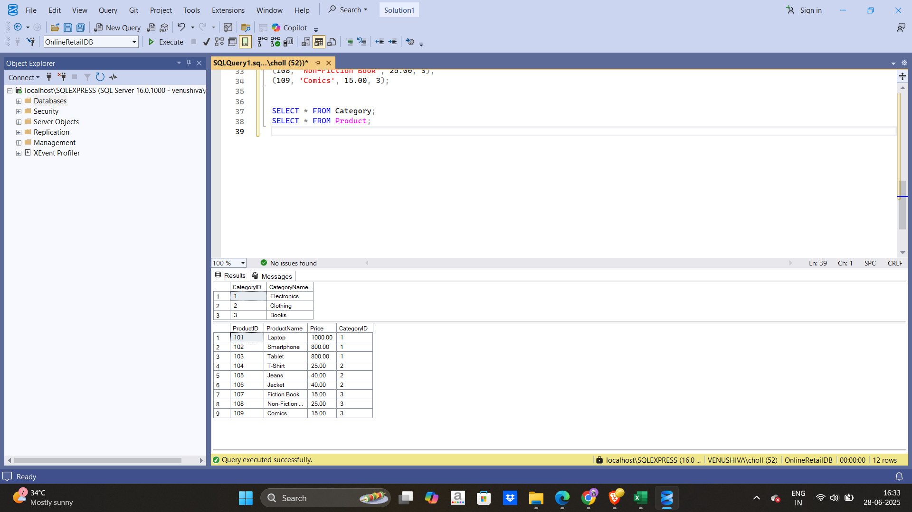
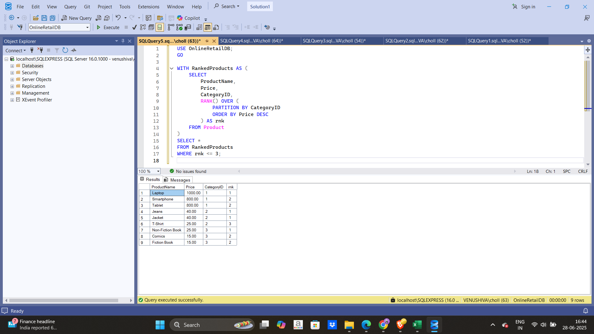

# 🛍️ Advanced SQL Exercises for Online Retail Store

This project provides hands-on practice with **Advanced SQL concepts**, specifically **Window Functions and Ranking**. It simulates an **Online Retail Store** environment with two main tables: `Category` and `Product`.

## 📌 Objective

Use SQL window functions to:
- Rank products within each category
- Compare different ranking functions like `ROW_NUMBER()`, `RANK()`, and `DENSE_RANK()`
- Extract the top 3 most expensive products per category

## 🧱 Schema Overview

### 🗂️ Tables

#### Category
| Column Name   | Data Type | Description             |
|---------------|-----------|-------------------------|
| CategoryID    | INT       | Primary key             |
| CategoryName  | VARCHAR   | Name of the category    |

#### Product
| Column Name   | Data Type     | Description               |
|---------------|---------------|---------------------------|
| ProductID     | INT           | Primary key               |
| ProductName   | VARCHAR       | Name of the product       |
| Price         | DECIMAL(10,2) | Product price             |
| CategoryID    | INT           | Foreign key from Category |

## 🧪 Data



The script seeds the following data:

- **Categories**: Electronics, Clothing, Books
- **Products**: A mix of items across categories with varying prices

## 🧠 Exercises

### Row Number Ranking
```sql
SELECT 
    CategoryID,
    ProductName,
    Price,
    ROW_NUMBER() OVER (
        PARTITION BY CategoryID 
        ORDER BY Price DESC
    ) AS RowNum
FROM Product;
```


### Output 

Output.png)


### Rank Function Ranking
```sql
USE OnlineRetailDB;
GO

SELECT 
    CategoryID,
    ProductName,
    Price,
    RANK() OVER (
        PARTITION BY CategoryID 
        ORDER BY Price DESC
    ) AS RankNum
FROM Product;
```


### Output 

Output.png)


### Dense Rank Function Ranking
```sql
USE OnlineRetailDB;
GO

SELECT 
    CategoryID,
    ProductName,
    Price,
    DENSE_RANK() OVER (
        PARTITION BY CategoryID 
        ORDER BY Price DESC
    ) AS DenseRankNum
FROM Product;
```


### Output 

Output.png)

### Row Number Ranking
```sql
USE OnlineRetailDB;
GO

WITH RankedProducts AS (
    SELECT 
        ProductName,
        Price,
        CategoryID,
        RANK() OVER (
            PARTITION BY CategoryID 
            ORDER BY Price DESC
        ) AS rnk
    FROM Product
)
SELECT *
FROM RankedProducts
WHERE rnk <= 3;
```


### Output 




## ⚙️ How to Run
1.Ensure you have a SQL Server database (or compatible system) set up.

2.Execute the full script in your SSMS.

3.Use the USE OnlineRetailDB; directive to switch to the correct database.