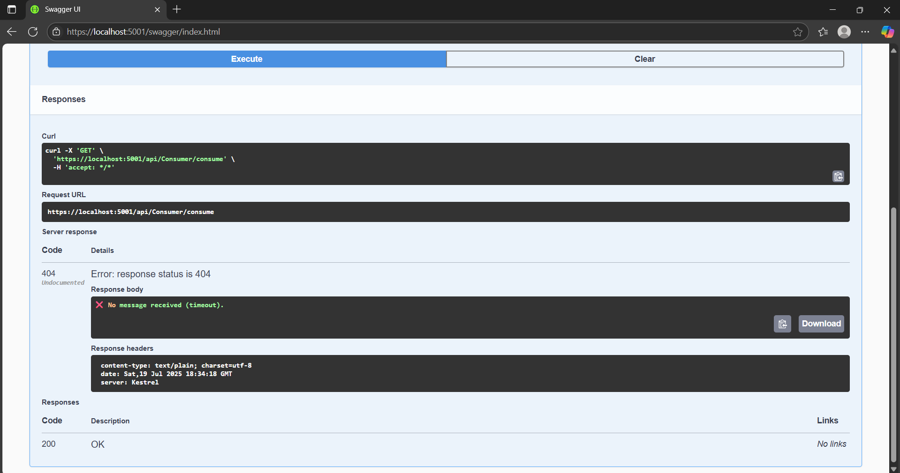

# Kafka Messaging Demo with .NET 6

This is a complete hands-on Kafka messaging system built using ASP.NET Core and Apache Kafka. It includes:

- 🔹 `KafkaProducerDemo` – ASP.NET Core Web API that **produces messages** to Kafka.
- 🔹 `KafkaConsumerDemo` – ASP.NET Core Web API that **consumes messages** from Kafka.

Built as part of **Digital Nurture 4.0 – Deep Skilling (.NET FSE)**.

---

## 🛠 Requirements

- [.NET 6 SDK](https://dotnet.microsoft.com/download)
- [Apache Kafka 3.6+](https://kafka.apache.org/)
- Java 11+ (needed for Kafka)
- Kafka running locally on:
  - 🧠 `localhost:2181` → ZooKeeper
  - 🧠 `localhost:9092` → Kafka broker

---

## 🔧 Kafka Setup Steps (Windows)

1. **Start Zookeeper**  
   ```bash
   cd C:\kafka_2.13-3.6.1\bin\windows
   zookeeper-server-start.bat ..\..\config\zookeeper.properties
   ```
   

2. **Start Kafka Broker**

   ```bash
   kafka-server-start.bat ..\..\config\server.properties
   ```
   

3. **Create Kafka Topic**

   ```bash
   kafka-topics.bat --create --topic chat-topic --bootstrap-server localhost:9092 --partitions 1 --replication-factor 1
   ```
   

---

## 📦 KafkaProducerDemo (Web API)

This app exposes a REST API to send messages to Kafka.

### 🔗 Endpoint:

```
POST /api/Kafka/send
```


### 📥 Sample Request (JSON)

.png)

### ✅ Output

* Message is published to `chat-topic`
* Response:

  .png)

### 🔁 Config (`appsettings.json`)

```json
"Kafka": {
  "BootstrapServers": "localhost:9092",
  "Topic": "chat-topic"
}
```

---

## 📦 KafkaConsumerDemo (Web API)

This app exposes a GET endpoint that consumes messages from Kafka.

### 🔗 Endpoint:

```
GET /api/Consumer/consume
```


### ✅ Output

* Reads one message from `chat-topic`
* If a message is found:

  ```
  ✅ Received message: kafka ka baap
  ```
  
  
* If no message found in 5 seconds:

  ```
  ❌ No message received (timeout).
  ```
  

---

## 🧪 Full Workflow

| Step | Action                                        |
| ---- | --------------------------------------------- |
| 1️⃣  | Run Zookeeper + Kafka                         |
| 2️⃣  | Run `KafkaProducerDemo` (`dotnet run`)        |
| 3️⃣  | Open Swagger: `http://localhost:5000/swagger` |
| 4️⃣  | POST a message to `/api/Kafka/send`           |
| 5️⃣  | Run `KafkaConsumerDemo` (`dotnet run`)        |
| 6️⃣  | Call `GET /api/Consumer/consume` from Swagger |
| 7️⃣  | Confirm message received ✅                   |

---

## 📂 Folder Structure

```
KafkaProducerDemo/
├── Controllers/
│   └── KafkaController.cs
├── Models/
│   └── MessageRequest.cs
├── appsettings.json
└── Program.cs

KafkaConsumerDemo/
├── Controllers/
│   └── ConsumerController.cs
├── Program.cs
└── launchSettings.json
```

---

## 🧠 Notes

* Uses **Confluent.Kafka** NuGet package for producer/consumer APIs.
* Simple controller-based APIs with **Swagger UI** for testing.
* Built for **hands-on learning and integration testing**.

---
