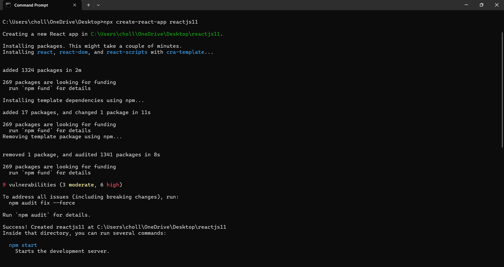
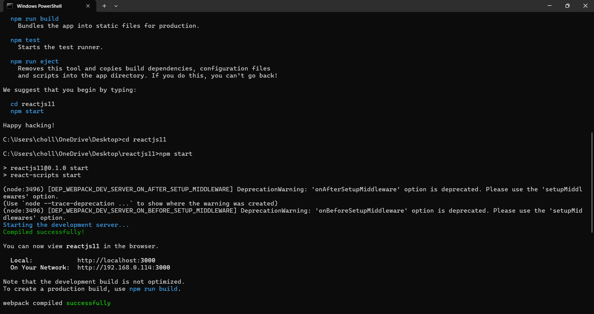
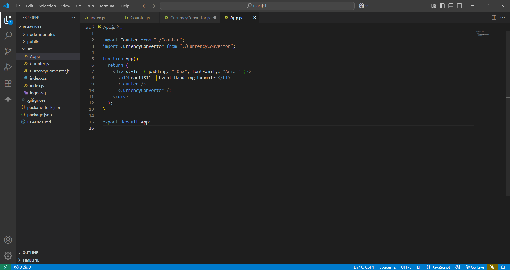
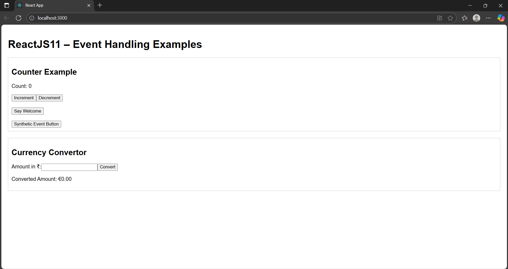
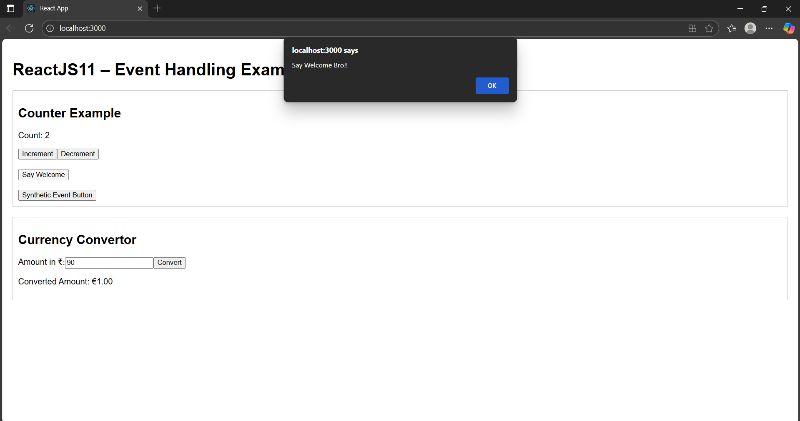
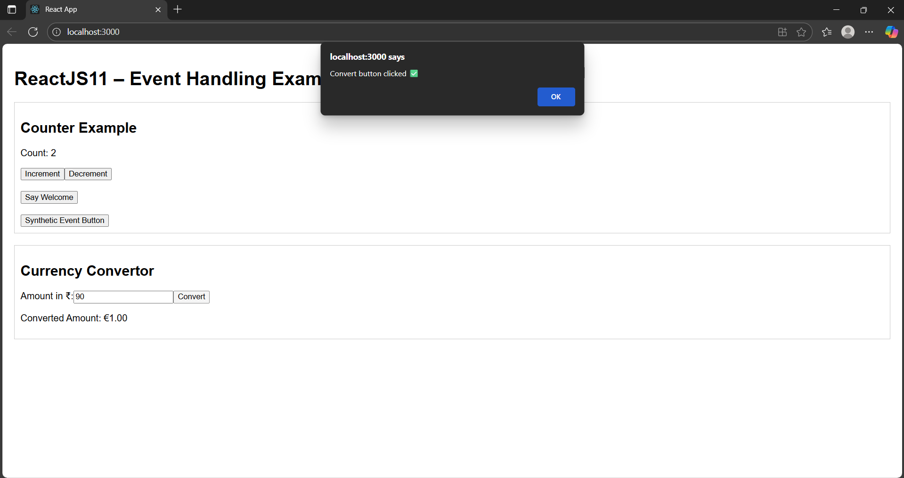

# 📄 README – ReactJS HOL (Week 11)

## 📌 Project Name
**ReactJS11 – Event Handling Examples**

---

## 🎯 Objective
This hands-on lab demonstrates ReactJS event handling concepts, including:  
✅ Using React events & event handlers  
✅ Triggering multiple functions from one event  
✅ Synthetic events in React  
✅ Passing arguments to event handler functions  
✅ Handling form submission events

---

## 🏗 Steps Performed

1️⃣ **Created React App**  
```bash
npx create-react-app reactjs11
```


```bash
cd reactjs11
npm start
```



2️⃣ **Cleaned up boilerplate**  
- Deleted: `App.css`, `logo.svg`, `App.test.js`, `setupTests.js`, `reportWebVitals.js`  
- Removed unused imports from `App.js` and `index.js`

3️⃣ **Created Components**
- `Counter.js` – Implements buttons for Increment, Decrement, Say Welcome, and Synthetic Event demo.  
- `CurrencyConvertor.js` – Converts Rupees to Euro when Convert button is clicked.

4️⃣ **App Integration**
- Imported both components into `App.js` to display them on the same page.

---

## 📂 Project Structure
```
reactjs11/
 ├── node_modules/
 ├── public/
 ├── src/
 │   ├── App.js
 │   ├── index.js
 │   ├── Counter.js
 │   ├── CurrencyConvertor.js
 │   ├── index.css
 ├── package.json
 └── README.md
```



---

## 📸 Screenshots Captured
1️⃣ **VS Code Project Structure** (showing `Counter.js` & `CurrencyConvertor.js`)  
2️⃣ **Terminal** (`npm start` running)  
3️⃣ **Browser Output – Counter Section**  
   - Increment/Decrement updates count  
   - Alerts for “Hello” and “Say Welcome”  
   - Synthetic Event button alert (“I was clicked”)  
4️⃣ **Browser Output – Currency Convertor Section**  
   - Enter ₹ amount → click Convert → **Alert shown** & converted value displayed.

---

## ✅ How to Run
1. Install dependencies:  
```bash
npm install
```
2. Start the app:  
```bash
npm start
```
3. Open browser at **http://localhost:3000**.

---

## 📊 Output Expectations
- **Counter Section:**
  
  
  - Increment button increases count **and** alerts “Hello! Count increased!”
  

  - Say Welcome button shows alert “Say Welcome”
  

  - Synthetic Event button alerts “I was clicked”
  

- **Currency Convertor Section:**
  - Clicking Convert alerts “Convert button clicked ✅” and displays Euro value.


---
