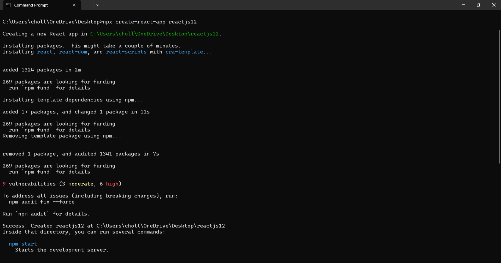
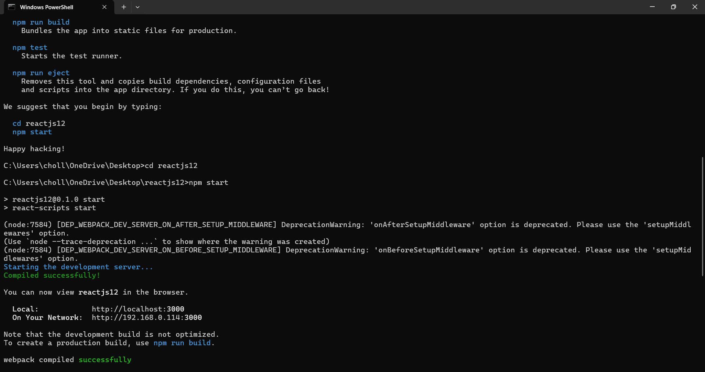
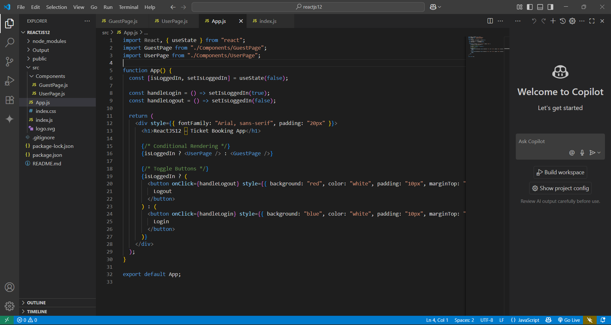
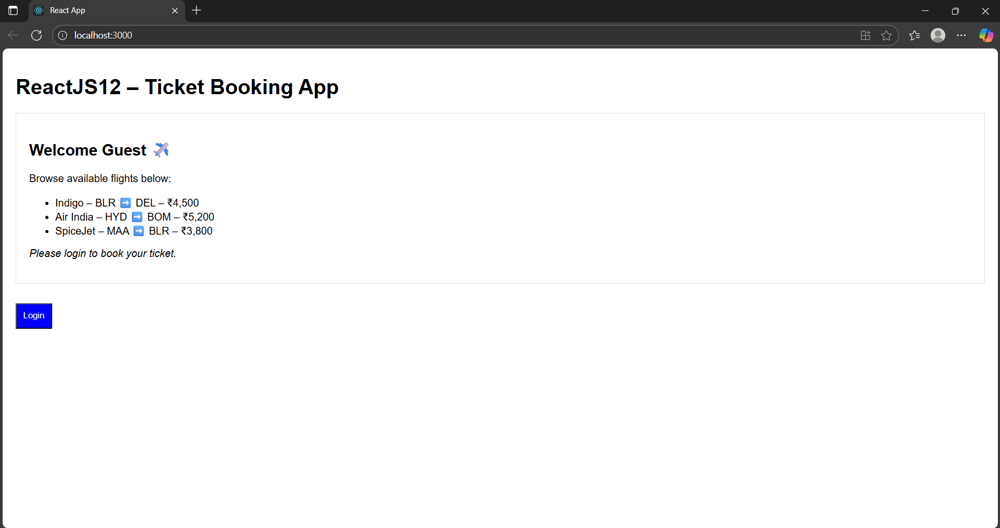
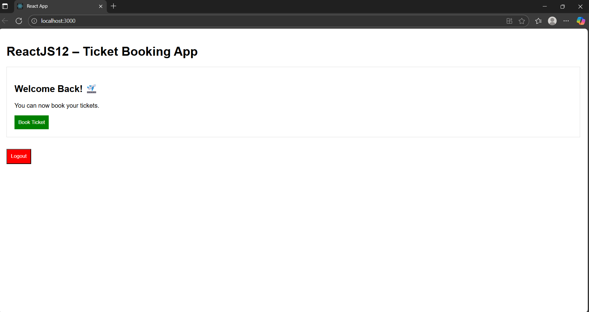

# 📄 README – ReactJS HOL (Week 12)

## 📌 Project Name
**ReactJS12 – Ticket Booking App**

---

## 🎯 Objective
This hands-on lab demonstrates **conditional rendering** in React, including:  
✅ Using element variables for conditional views  
✅ Rendering different components based on state (logged in / guest)  
✅ Toggling UI with Login/Logout buttons

---

## 🏗 Steps Performed

1️⃣ **Created React App**  
```bash
npx create-react-app reactjs12
```



```bash
cd reactjs12
npm start
```




2️⃣ **Cleaned up boilerplate**  
- Deleted: `App.css`, `logo.svg`, `App.test.js`, `setupTests.js`, `reportWebVitals.js`  
- Removed unused imports from `App.js` and `index.js`.

3️⃣ **Created Components**
- `GuestPage.js` – Displays flight listings for guest users.
- `UserPage.js` – Shows booking option for logged-in users.

4️⃣ **Conditional Rendering**
- Used a state variable `isLoggedIn` in `App.js`.
- When `isLoggedIn = false` → **GuestPage** displayed + **Login** button.
- When `isLoggedIn = true` → **UserPage** displayed + **Logout** button.

---

## 📂 Project Structure
```
reactjs12/
 ├── node_modules/
 ├── public/
 ├── src/
 │   ├── App.js
 │   ├── index.js
 │   ├── GuestPage.js
 │   ├── UserPage.js
 │   ├── index.css
 ├── package.json
 └── README.md
```


---

## ✅ How to Run
1. Install dependencies:  
```bash
npm install
```
2. Start the app:  
```bash
npm start
```
3. Open browser at **http://localhost:3000**.

---

## 📊 Output Expectations
- **Guest View (Default)**:
  - Flight details displayed.
  - Login button visible.

  

- **User View (After Login)**:
  - Booking option displayed.
  - Logout button visible.

  

---
