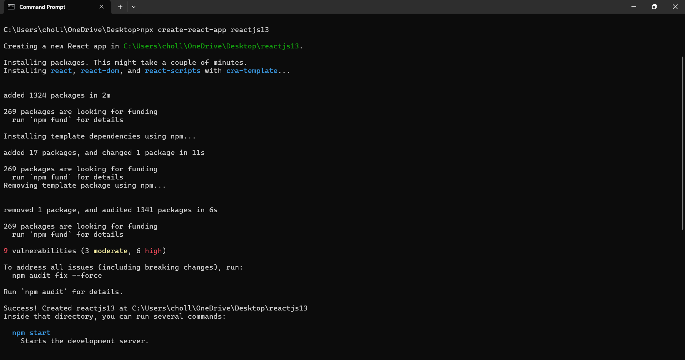
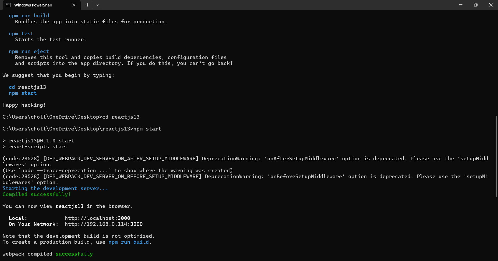
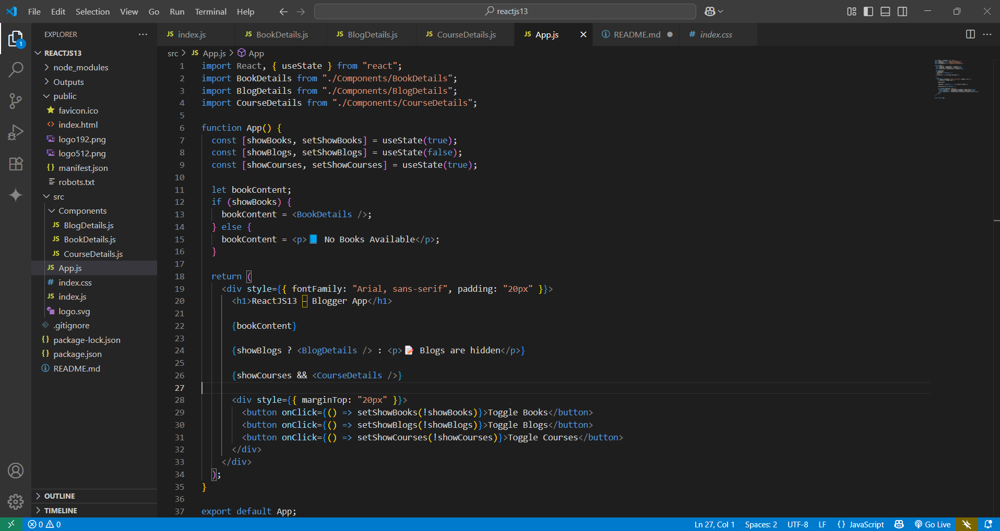
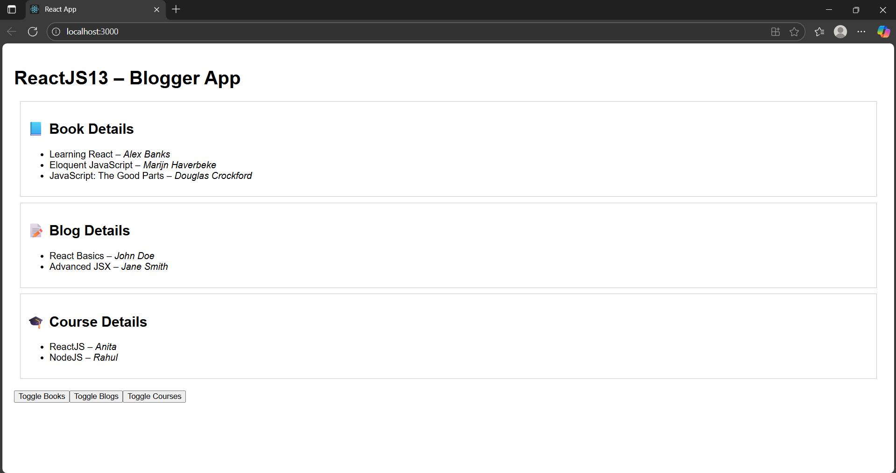
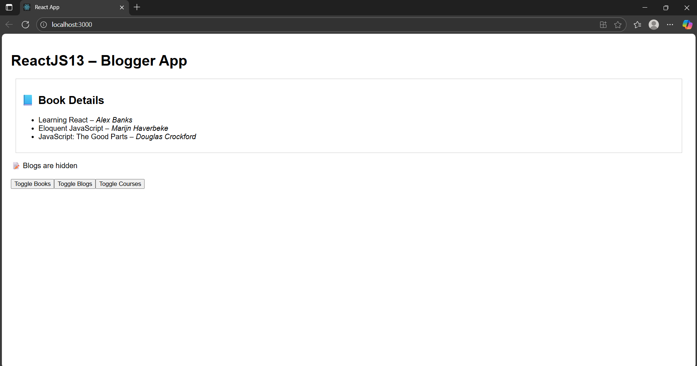
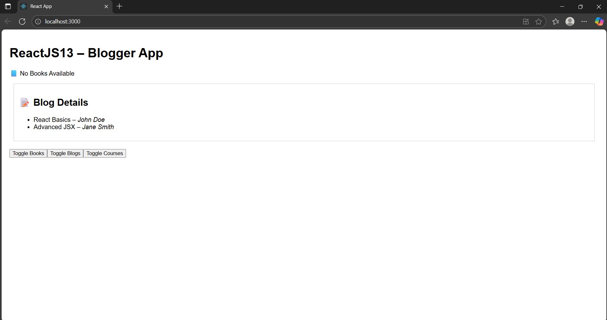
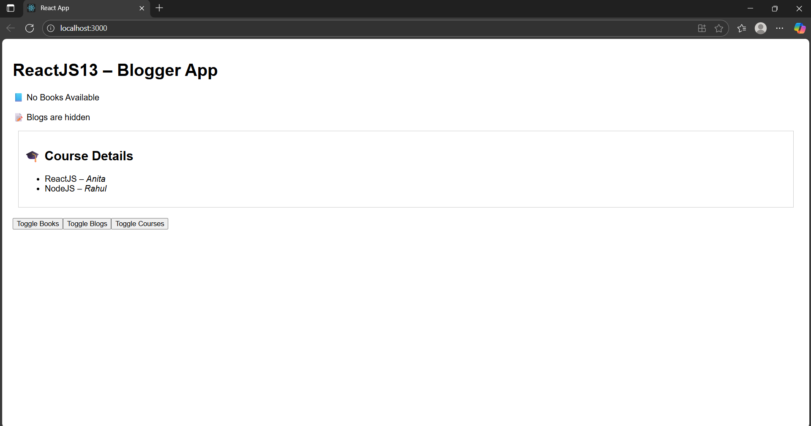
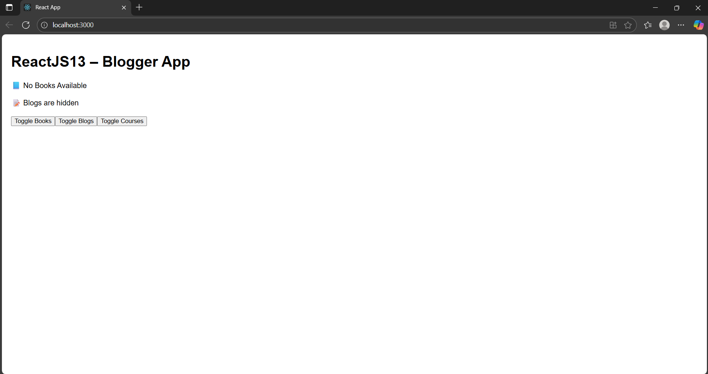

# 📄 README – ReactJS HOL (Week 13)

## 📌 Project Name
**ReactJS13 – Blogger App**

---

## 🎯 Objective
This hands-on lab demonstrates **multiple ways of conditional rendering** in React, including:  
✅ Using **element variables**  
✅ Using **ternary operator** (`condition ? true : false`)  
✅ Using **logical AND (&&)** for inline rendering  
✅ Using **map()** with **keys** to display lists of data.

---

## 🏗 Steps Performed

1️⃣ **Created React App**  
```bash
npx create-react-app reactjs13
```



```bash
cd reactjs13
npm start
```



2️⃣ **Cleaned up boilerplate**  
- Deleted: `App.css`, `logo.svg`, `App.test.js`, `setupTests.js`, `reportWebVitals.js`  
- Removed unused imports from `App.js` and `index.js`.

3️⃣ **Created Components**
- `BookDetails.js` – Displays a list of books using **map()** and **keys**.
- `BlogDetails.js` – Displays a list of blogs.
- `CourseDetails.js` – Displays a list of courses.

4️⃣ **Conditional Rendering Demonstrated in App.js**
- **Element Variable:** Used for **BookDetails**.
- **Ternary Operator:** Used for **BlogDetails**.
- **Logical AND (&&):** Used for **CourseDetails**.
- Added **toggle buttons** to dynamically show/hide each section.

---

## 📂 Project Structure
```
reactjs13/
 ├── node_modules/
 ├── public/
 ├── src/
 │   ├── App.js
 │   ├── index.js
 │   ├── BookDetails.js
 │   ├── BlogDetails.js
 │   ├── CourseDetails.js
 │   ├── index.css
 ├── package.json
 └── README.md
```




---

## ✅ How to Run
1. Install dependencies:  
```bash
npm install
```
2. Start the app:  
```bash
npm start
```
3. Open browser at **http://localhost:3000**.

---

## 📊 Output Expectations




- **Book Section:** Rendered using **element variable** (shows list OR “No Books Available”).  



- **Blog Section:** Rendered using **ternary operator** (shows blogs OR “Blogs are hidden”).



- **Course Section:** Rendered using **logical AND (&&)**.




- **Buttons:** Toggle each section on/off dynamically.



