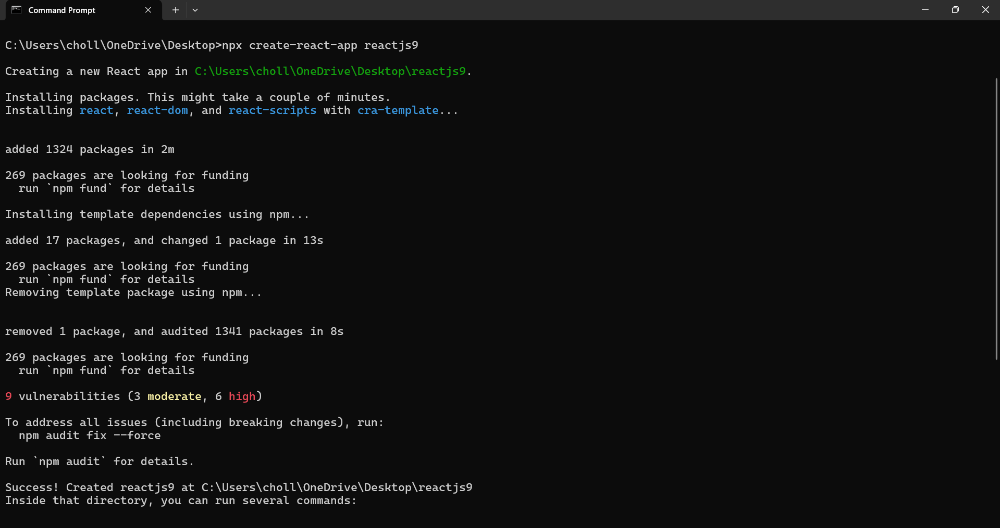
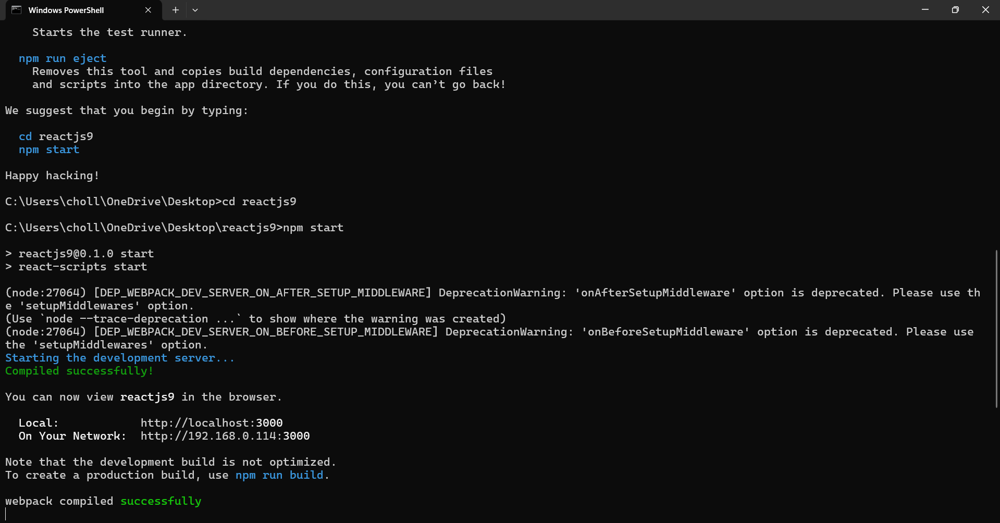
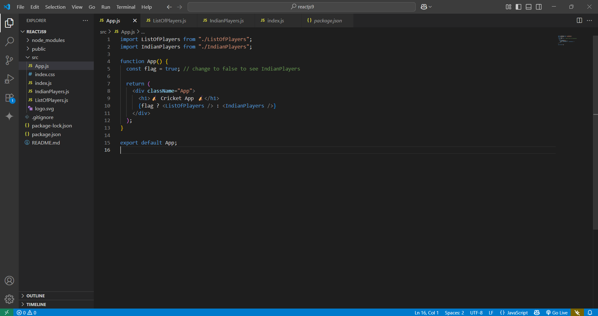

# 📄 README – ReactJS HOL (Digital Nurture 4.0)

## 📌 Project Name
**ReactJS9 – Cricket App**

---

## 🎯 Objective
This hands-on lab demonstrates ES6 and ReactJS concepts, including:  
✅ `map()` method of ES6  
✅ Arrow functions  
✅ Destructuring assignment  
✅ Array merging (spread operator)  
✅ Conditional rendering in React

---

## 🏗 Steps Performed

1️⃣ **Created React App**  
```bash
npx create-react-app reactjs9
```


```bash
cd reactjs9
npm start
```



2️⃣ **Cleaned up boilerplate**  
- Deleted: `App.css`, `logo.svg`, `App.test.js`, `setupTests.js`, `reportWebVitals.js`
- Removed unused imports from `App.js` and `index.js`

3️⃣ **Created Components**
- `ListOfPlayers.js` – Shows 11 players & filters those scoring below 70 using **map()** and **arrow functions**  
- `IndianPlayers.js` – Merges `T20players` & `RanjiTrophy` arrays, displays merged list, and splits them into **Odd** & **Even** players using **destructuring**

4️⃣ **Conditional Rendering**
- Used a **flag variable** in `App.js`:
```jsx
{flag ? <ListOfPlayers /> : <IndianPlayers />}
```
- `flag = true` → Shows **ListOfPlayers**  
- `flag = false` → Shows **IndianPlayers**

---

## 📂 Project Structure
```
reactjs9/
 ├── node_modules/
 ├── public/
 ├── src/
 │   ├── App.js
 │   ├── index.js
 │   ├── ListOfPlayers.js
 │   ├── IndianPlayers.js
 │   ├── index.css
 ├── package.json
 └── README.md
```



---

## ✅ How to Run
1. Install dependencies:  
```bash
npm install
```
2. Start the app:  
```bash
npm start
```
3. Open browser at **http://localhost:3000**.

---

## 📊 Output Expectations
✅ **When `flag = true`:**
- Shows all players with scores.
- Shows players with scores below 70.

.png>)

✅ **When `flag = false`:**
- Shows merged list of T20 and RanjiTrophy players.
- Shows odd team players.
- Shows even team players.

.png>)

---

