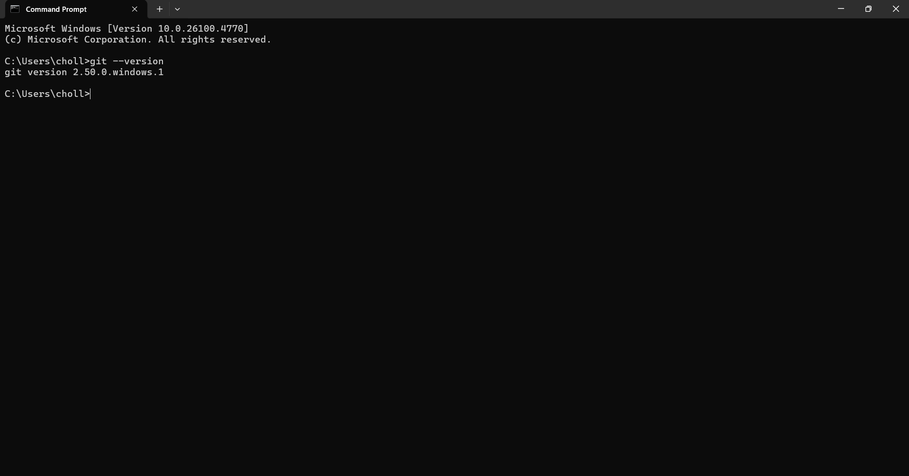

````markdown
# Git Hands-on Lab

This repository was created as part of a Git Hands-on exercise.  
It demonstrates basic Git commands, editor configuration, and pushing code to a remote GitLab repository.

---

## 1. Prerequisites
- **Git for Windows (Git Bash)**
- **Notepad++**
- **GitLab** account

---

## 2. Steps Performed

### Step 1 — Verify Git Installation
```bash
git --version
````


### Step 2 — Configure Git Global Identity

```bash
git config --global user.name "Your Name"
git config --global user.email "you@example.com"
```


### Step 3 — Set Notepad++ as Git Editor

Added `C:\Program Files\Notepad++` to the system PATH, then:

```bash
git config --global core.editor "notepad++ -multiInst -nosession -wait"
```


### Step 4 — Create Local Repository

```bash
mkdir GitDemo
cd GitDemo
git init
```


### Step 5 — Create File and Check Status

```bash
echo "Welcome to GitDemo" > welcome.txt
git status
```


### Step 6 — Stage and Commit File

```bash
git add welcome.txt
git commit
```


Commit message entered via **Notepad++**:

```
Add welcome.txt
This file was added for the Git hands-on lab.
```

### Step 7 — Create Remote GitLab Repository

Created a project in GitLab named **GitDemo**.


### Step 8 — Link Remote and Push

```bash
git remote add origin https://gitlab.com/<group>/<project>.git
```


```bash
git pull --rebase origin main
git push -u origin main

```


---

## 3. Verification

* Local repository initialized
* `welcome.txt` committed
* Repository linked and pushed to GitLab
* File and commit visible in GitLab web interface

---
