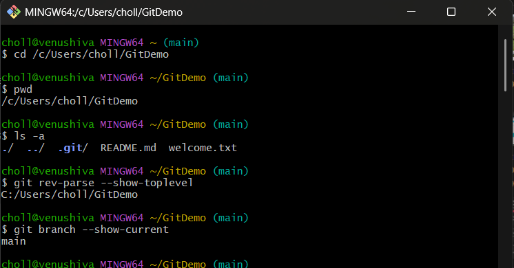
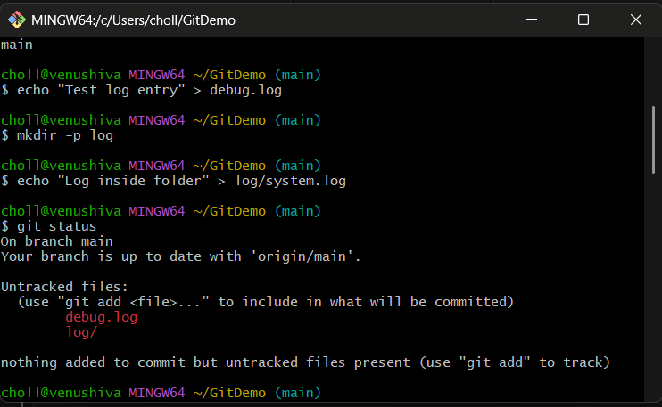
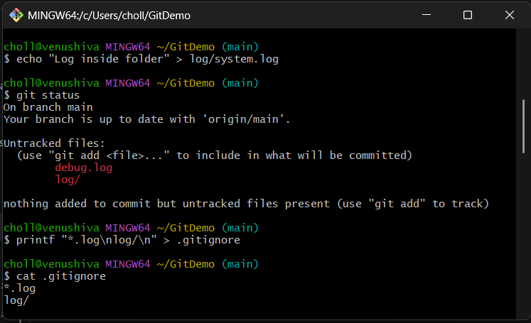
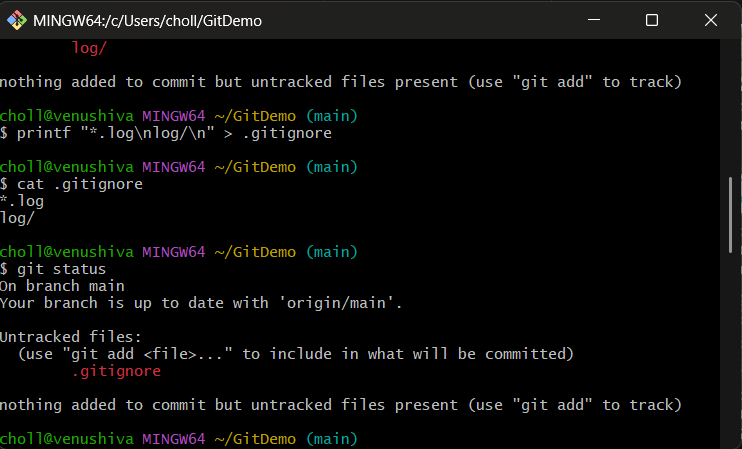
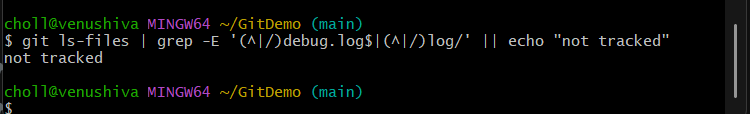
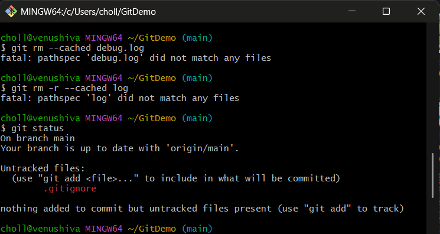
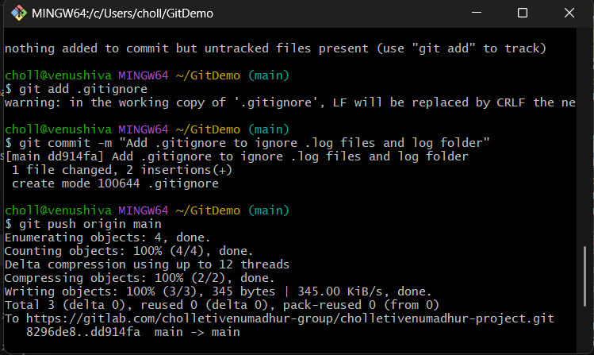
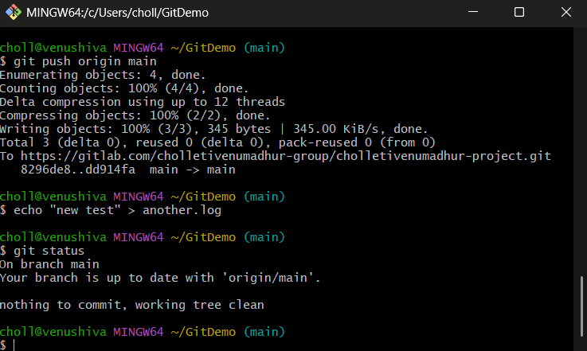

````markdown
# Git Hands-on 2: Using `.gitignore` to Ignore Unwanted Files

## Objective
Create and verify a `.gitignore` file that prevents Git from tracking `.log` files and any `log/` directory.

---

## Prerequisites
- Git installed and configured.
- Local repository at `C:\Users\choll\GitDemo` (repo root).
- Work done in **Git Bash**.

---

## Full command list (run from repo root `/c/Users/choll/GitDemo`)

### Navigate & verify repo root
```bash
cd /c/Users/choll/GitDemo
pwd
ls -a
git rev-parse --show-toplevel
git branch --show-current
````




### Create initial test files (to demonstrate ignoring)

```bash
echo "Test log entry" > debug.log
mkdir -p log
echo "Log inside folder" > log/system.log
git status
```




### Create `.gitignore`

Option A (shell):

```bash
printf "*.log\nlog/\n" > .gitignore
```

Verify:

```bash
cat .gitignore
```


### Re-check status after adding `.gitignore`

```bash
git status
```




### If logs were previously tracked (untrack but keep files locally)

Check whether files are tracked:

```bash
git ls-files | grep -E '(^|/)debug.log$|(^|/)log/' || echo "not tracked"
```




```bash
git rm --cached debug.log
git rm -r --cached log
git status
```


### Stage & commit `.gitignore`

```bash
git add .gitignore
git commit -m "Add .gitignore to ignore .log files and log folder"
```



### Verify ignore rule with a new test file

```bash
echo "new test" > another.log
git status
```



---
