````markdown
# Git Hands-on 3: Branching & Merging

## Objective
- Create and work on a new branch.
- Make changes and commit them in the branch.
- Merge changes into master/main.
- View differences using CLI (and optionally P4Merge).
- Delete the branch after merge.

---

## Prerequisites
- Git installed and configured.
- Local repository at `C:\Users\choll\GitDemo`.
- P4Merge installed (optional for visual diff).

---

## Steps

### 1. Navigate to the Repository Root
```bash
cd /c/Users/choll/GitDemo
pwd
ls -a
git branch --show-current
````

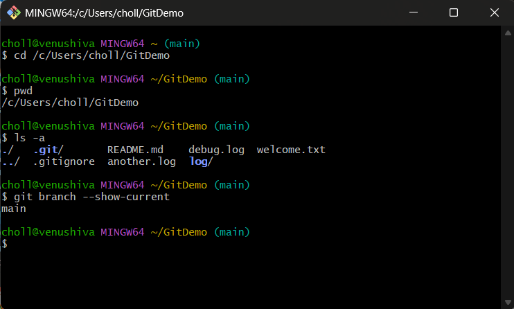

---

### 2. Create a New Branch

```bash
git branch GitNewBranch
git branch -a
```

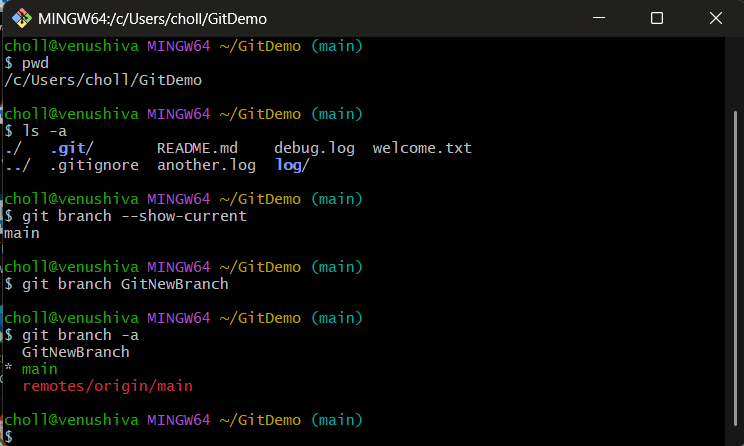

---

### 3. Switch to the New Branch

```bash
git checkout GitNewBranch
git branch --show-current
```

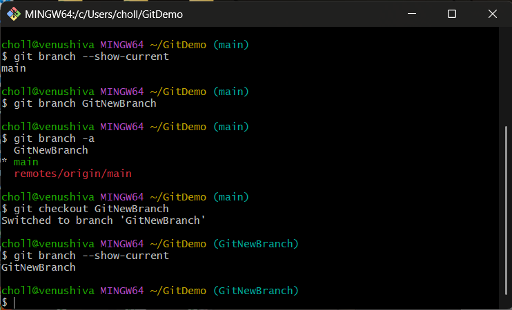

---

### 4. Add a File in the New Branch

```bash
echo "This is content in GitNewBranch" > branchfile.txt
git status
```

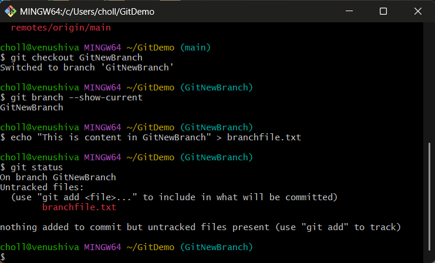

---

### 5. Stage and Commit the File

```bash
git add branchfile.txt
git commit -m "Add branchfile.txt in GitNewBranch"
git status
```

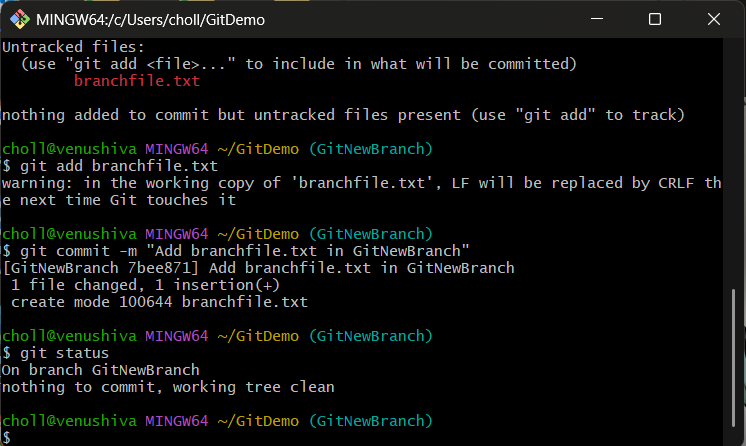

---

### 6. Switch Back to Master/Main

```bash
git checkout master   # or: git checkout main
```

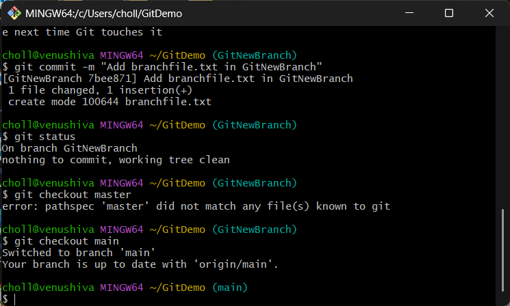

---

### 7. Show Differences Between Branches (CLI)

```bash
git diff master GitNewBranch   # if on master
# OR:
git diff main GitNewBranch     # if on main
```

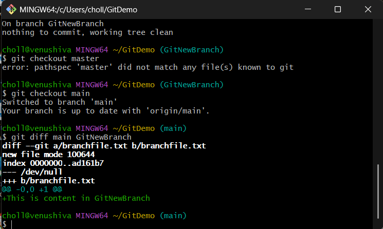

---

### 8. Merge the Branch into Master/Main

```bash
git merge GitNewBranch
```

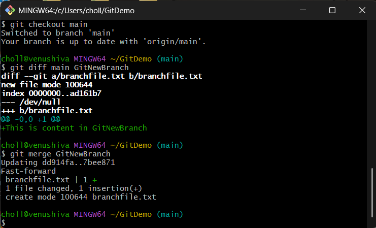

---

### 9. View Merge History Graph

```bash
git log --oneline --graph --decorate
```

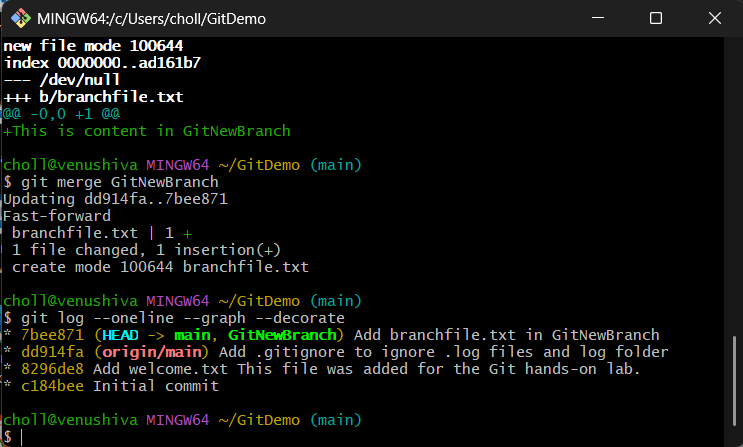

---

### 10. Delete the Branch

```bash
git branch -d GitNewBranch
git branch -a
```

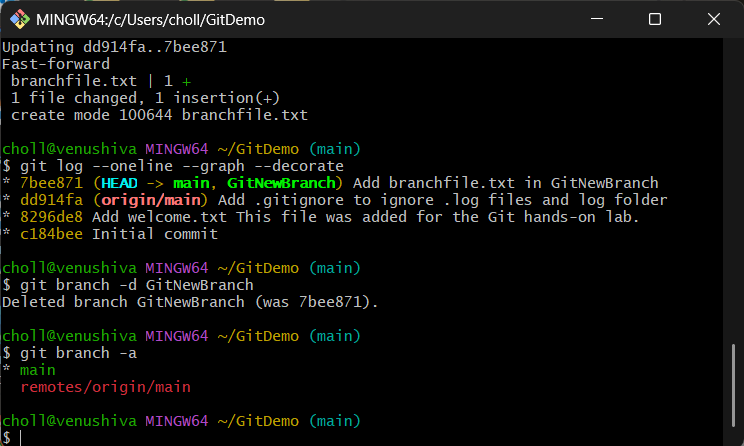

---

### 11. Final Status

```bash
git status
```

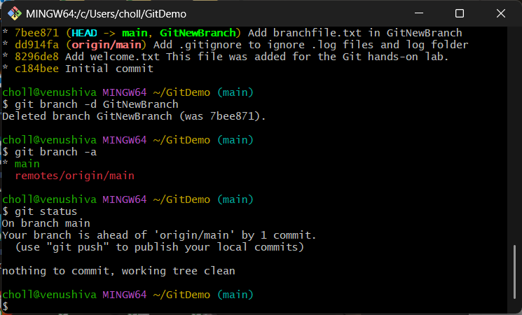

---
