````markdown
# Git Hands-on 4: Merge Conflict Resolution

## Objective
Simulate a merge conflict between master/main and a branch, resolve it, and commit the changes.

---

## Prerequisites
- Git installed and configured.
- Local repository at `C:\Users\choll\GitDemo`.
- P4Merge installed (optional for visual diff).

---

## Steps

### 1. Verify master/main is clean
```bash
cd /c/Users/choll/GitDemo
git checkout master    # or: git checkout main
git status
````

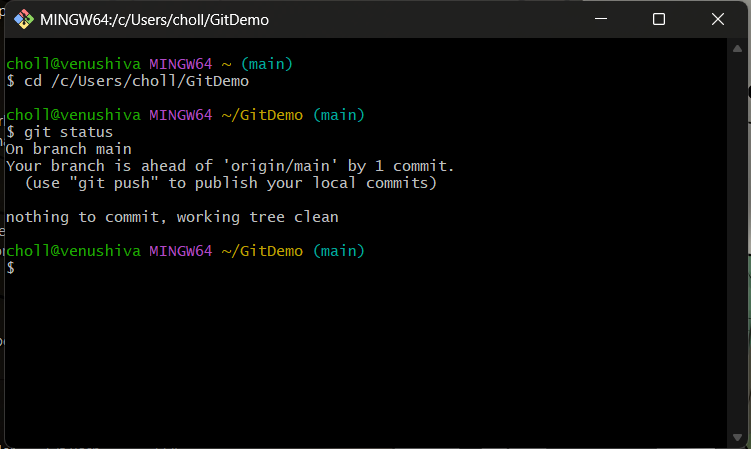

---

### 2. Create and switch to branch `GitWork`

```bash
git branch GitWork
git checkout GitWork
```

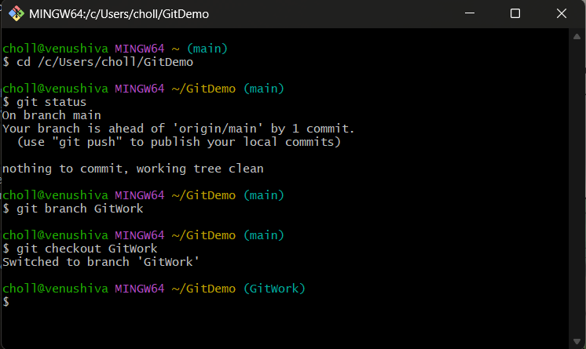

---

### 3. Add `hello.xml` in `GitWork`

```bash
echo "<message>Hello from GitWork branch</message>" > hello.xml
git add hello.xml
git commit -m "Add hello.xml in GitWork branch"
git status
```

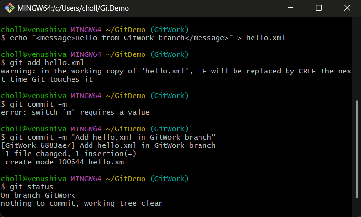

---

### 4. Switch back to master/main

```bash
git checkout main
```

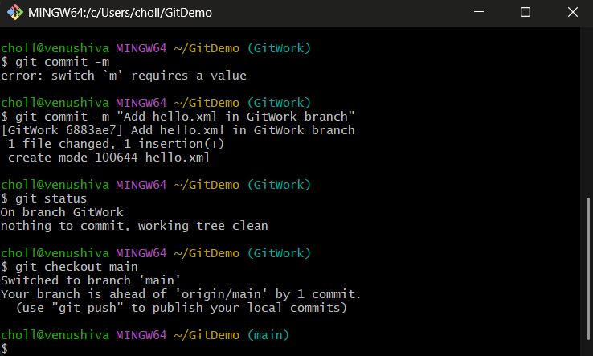

---

### 5. Add a different `hello.xml` in master/main

```bash
echo "<message>Hello from master branch</message>" > hello.xml
git add hello.xml
git commit -m "Add hello.xml in master branch with different content"
```

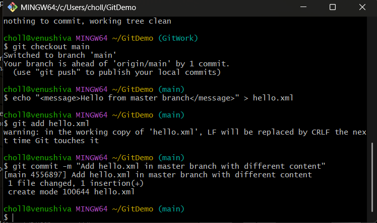

---

### 6. View commit history (all branches)

```bash
git log --oneline --graph --decorate --all
```

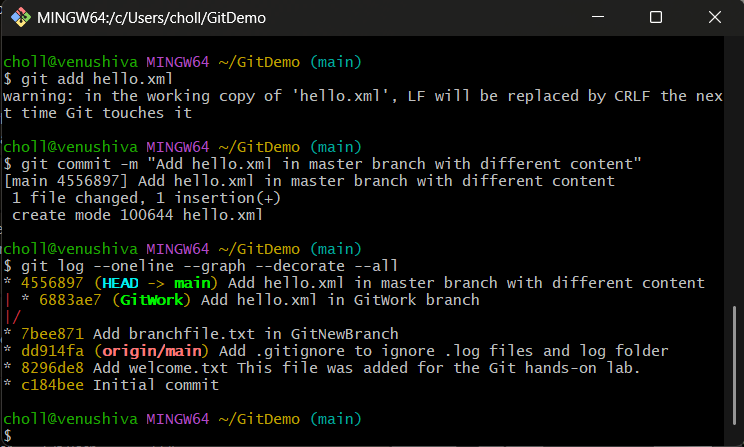

---

### 7. Show differences before merge

```bash
git diff master GitWork   # or: git diff main GitWork
```

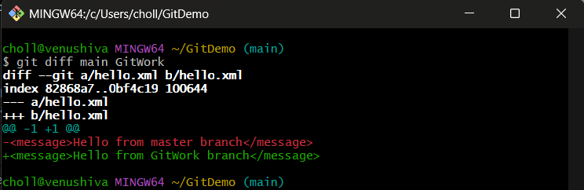

---

### 8. Merge `GitWork` into master/main (expect conflict)

```bash
git merge GitWork
```

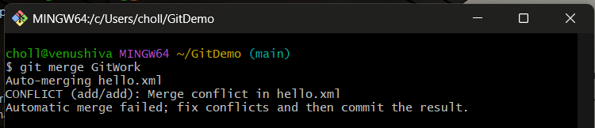

---

### 9. Resolve conflict

Edit `hello.xml` to desired final content:

```xml
<message>Hello from both branches</message>
```

Save the file.

---

### 10. Stage and commit resolved file

```bash
git add hello.xml
git commit -m "Resolve merge conflict in hello.xml"
```

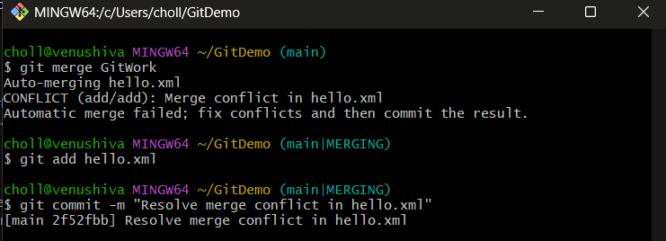

---


### 11. List and delete branch

```bash
git branch -a
git branch -d GitWork
```

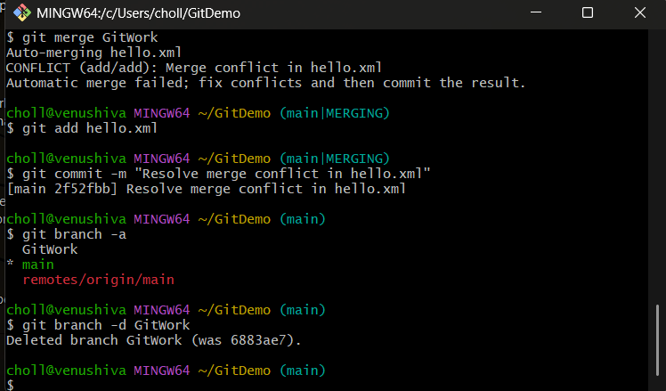

---

### 12. Final log and status

```bash
git log --oneline --graph --decorate
git status
```
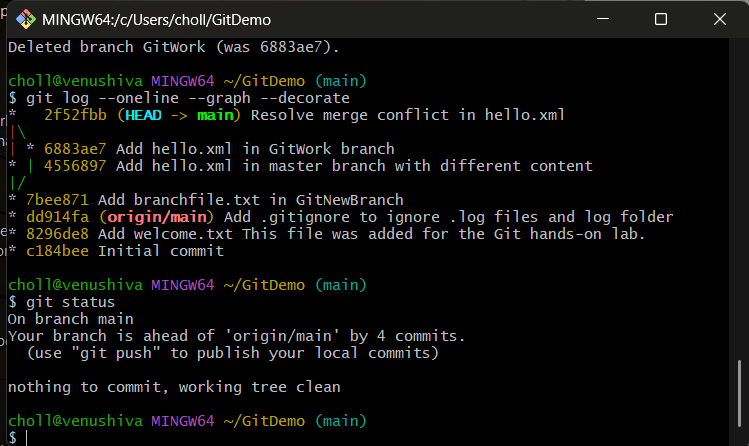

---
