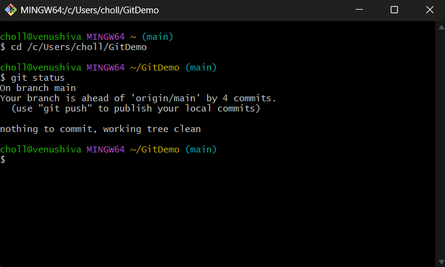
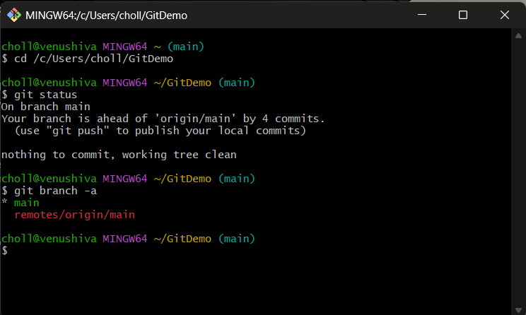
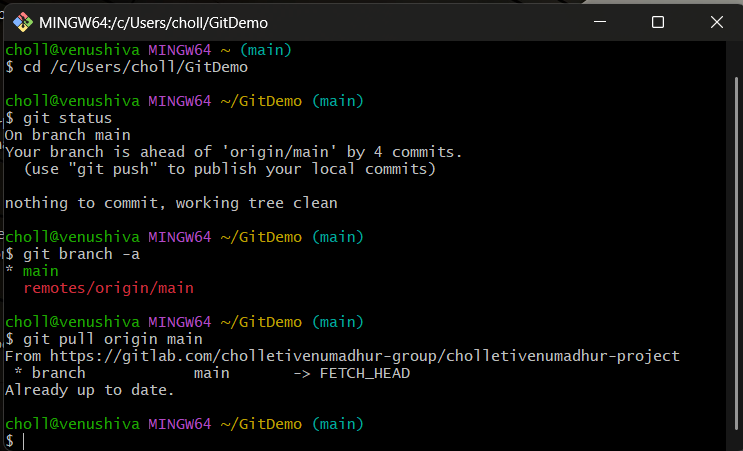
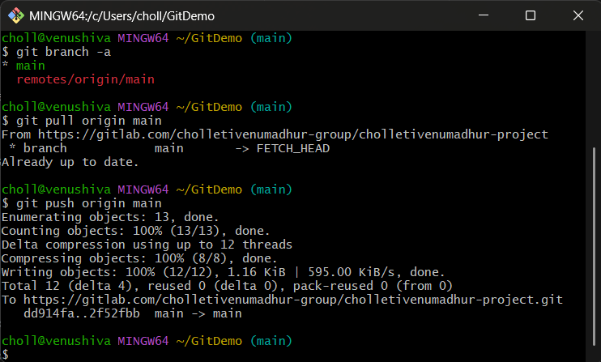
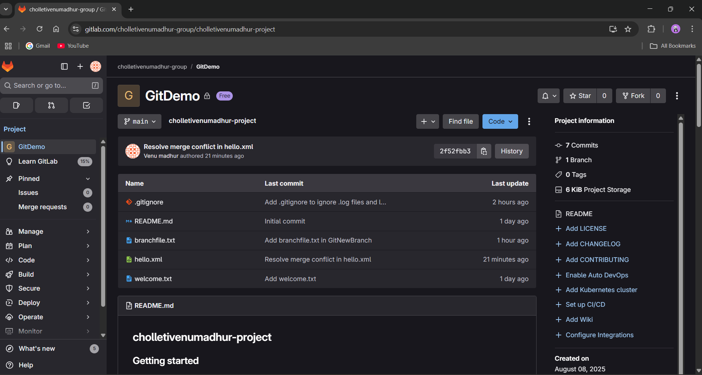

````markdown
# Git Hands-on 5: Clean Up & Push to Remote

## Objective
Verify the local master/main branch is clean, pull from the remote repository, push any pending changes, and confirm that updates are reflected on the remote.

---

## Prerequisites
- Git installed and configured.
- Local repository at `C:\Users/choll\GitDemo`.
- Remote repository linked (GitLab or GitHub).

---

## Steps

### 1. Ensure You Are on master/main and Working Tree is Clean

```bash
cd /c/Users/choll/GitDemo
git status
```



---

### 2. List All Local and Remote Branches

```bash
git branch -a
```



---

### 3. Pull the Latest Changes from Remote

```bash
git pull origin master   # or: git pull origin main
```



---

### 4. Push Any Pending Changes to Remote

```bash
git push origin master   # or: git push origin main
```



---

### 5. Verify Changes on Remote

* Open your GitLab/GitHub repository in a web browser.
* Confirm that commits and files from recent labs are visible.



---
